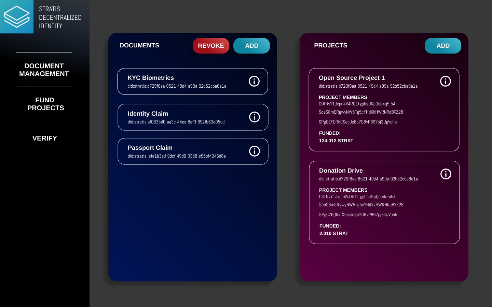

# DecentralizedID on Stratis

TODO youtube video demo

## Quickstart
Deploy the smart contract by placing the bytecode below on the Stratis
dashboard.
Click on Smart Contracts > Create Contract > Paste the byte code in the
Byte Code section > Enter your Stratis wallet password > Click on create
Contract
```
TODO
```

## Problem and Motivations
Identity management systems are largely dependent on centralized
authorities like domain name registries, government authorities,
certificate authorities, etc. These centralized authorities act
as roots of trust; however, they are single point of failures.
A better approach in the long run is to to rely on decentralized
identity systems where shared roots of trusts are used, thus
preventing single points of failure, increasing reliability, trust,
and transparency regarding identity. Decentralized identity gives the
individual control over one's identity instead of relinquishing control
over to a centralized authority.


<!-- With a reliable self-soverign identity mechanism, we can provide a more
transparent and truthful ecosystem for payouts. This can increase
transparency and improve accountability in systems where the flow of
payments. Such systems include royalty payouts, charity donations,
companies adopting the
[Open Startups Initiative](https://baremetrics.com/open-startups).

(Note that should privacy be desired, such a payment system should
be avoided. The system is meant for situations where transparency and
trust is favored over privacy). -->


## Solution
The first challenge we face is defining identity. Identity is built upon
a number of indicators:

1. Your physical attributes; for example, retina scans,
fingerprints, etc. These traits are used in biometrics to
ascertain identity

2. Entities that attest to your identity; for example, passport and id
cards issued by governments, etc.

3. Things that you have accumulated, achieved, and done throughout your
life; for example, awards, certifications, social media data.


All of these indicators can be decomposed into data and can be
either linked or stored in an identity document. Each of the document
may possess some marginal probability of failure. Increasing the number
of such documents tied to identity would increase the reliability of one's
decentralized identity.


<!-- In this project we introduced a payout mechanism for projects.
Such projects build and augment existing identity documents. The projects
can refer to media works that are seeking royalty payouts, donations,
or companies. The more contributors that had contributed payments
to the project the more reliable the project is at ascertaining the
identity. Projects are essentially a special kind of identity document
with payout functionality. -->


In order to implement this the decentralized identity mechanism
we will using recommendations and specifications from
[https://w3c.github.io/did-core/](https://w3c.github.io/did-core/).
We will adopt the decentralized identifier scheme as mentioned in the protocol
```
--- FORMAT ---

scheme:method:method-specific identifier

--- WHAT WE USE ---
did:stratis:<Some ID generated by the smart contract>
```

TODO: Insert illustration of DID and various documents

## Smart Contract Methods
TODO

### Example Contract Calls
1. Create Identity Documents
TODO

1. Revoking Identity Documents
(Note: To update simply revoke and create a new document)

1. Create and Funding Projects
TODO

1. Verifying Identity 

## Attack Vector Analysis
### Impersonation Attacks
There are a few notable channels that can enable impersonation attacks to
occur. One is Social Media (should it be used as a identity document), and
people copying projects and seeding payments.


#### Social Media
Social Media may be an unreliable source of data but it is easy to use and
integrate as an identity document. As such, it is a useful channel to
bootstrap the adoption such a system. An possible identity document is
placing your Stratis wallet address in the description on your bio and
placing the link in the identity document. An attacker can copy one's
social media profile and place a different wallet address on the bio.


It is unlikely that the attacker's copied profile would possess
the exact same signature as the original account in a short period of
time. In the case of Twitter, it is unlikely that the copied posts would
have the same people liking and retweeting. Copied posts would have
a different timestamp as attackers are unlikely to copy posts
instantaneously. This gives the person controlling the original profile
a reasonably long enough timeframe to report the attacker's profile or
announce on their own social profiles that the attacker's account is a
fraud.  


<!-- #### Copying Projects
An attacker may copy projects and subsequently seed projects with
payments to give the impression that the project is valid in order
to give the impression of a valid profile. A simple way of verifying
whether the payments are spoofed or not involves finding the identity of
the addresses that had contributed to the projects. The identity can be
deduced by the identity documents linked to the address that had
contributed to the project. The reliability of projects as an
identity document is dependent on the number of verifiable contributors.
Should there be no one who had contributed to the projects,
the projects are not reliable as identity documents.
There is also a scenario where a legitimate contributor might have
contributed to a fake project by accident. The likelihood of this event
happening can be mitigated with a UX design pattern where prior to
contribution the contributor is required to verify the identity of the
owners of the project. -->


### Failure Of Links
Suppose we used a link in the identity document and the link dies. The
identity document becomes invalid. We recognize that it is possible that
each document might fail. If the document has a 100% chance of failure it
is invalid as a identity document in the first place and cannot be used.
However, the probability likely ranges between a non-negligible % to 100%.
As such, an effective counter measure is to simply increase the number of
partially reliable identity documents pertaining to one's identity. 

## Further works
Due to a lack of time I am unable to commit to building out the UI for the
frontend. Below is the proposed frontend design. Apologies :(



## Requests for Comments and Contributions
The current implementation for the Stratis Hackathon is likely incomplete
or missing key features. Feel free to submit issues or pull requests.